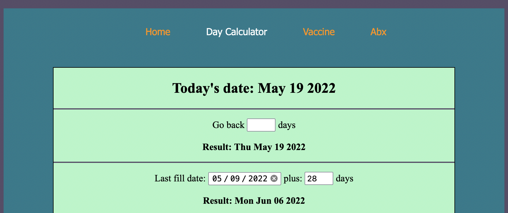

  
  
  <h2>Overview</h2>
  
 Rx Buddy is a retail pharmacist's little helper. It contains small tools to help quality of life for pharmacists in their everyday rush. These tools include a day calculator, vaccine recommendation, and a calculator for pediatric antibiotic dosing.
  
  <h2>How It Works</h2>
 Use the navbar on the top of the page to easily navigate between the different functions of Rx Buddy. The tool is designed to be small so that pharmacists can have the window open off to the side of their screen while they work. Go to Notes page to access database of client-submitted information. Refer back to Rx Buddy throughout the day as needed!
 
 
  <h2>Some Things I learned Making This Application</h2>
  
  <ul>
    <li>How to use React hooks</li>
    <li>How to use the Date method to do date math with user-given date inputs</li>
    <li>How to use styled components</li>
    <li>How to use NavLinks and styling active links</li>
    <li>How to incorporate favicon</li>
    <li>How to fix page refresh problem</li>
    <li>How to connect backend server with React, making this a fullstack MERN project</li>
   </ul>

<h2>Future Update Plans:</h2>
    <ul>
        <li>Add ability for users to manually upload antibiotics manually</li>
        <li>Add different color themes</li>
    </ul>

<h2>Want More?</h2>
If you'd like to see more about me, please visit my <a href="https://www.linkedin.com/in/icyparkinson/">LinkedIn</a>.

If you haven't given it a look yet, check out my <a href="https://sleepyanime.herokuapp.com">Anime Tracker</a>!
    
